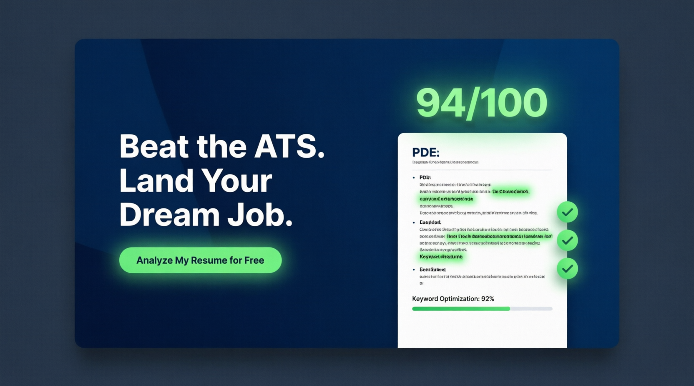
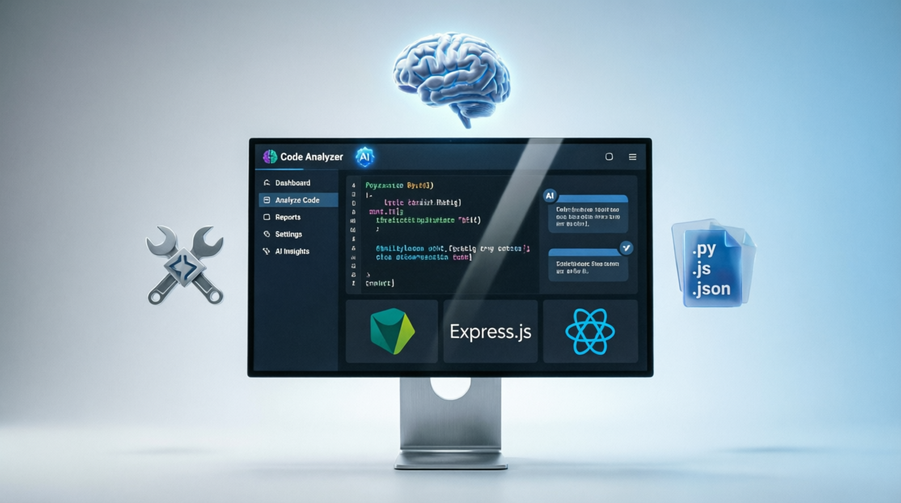
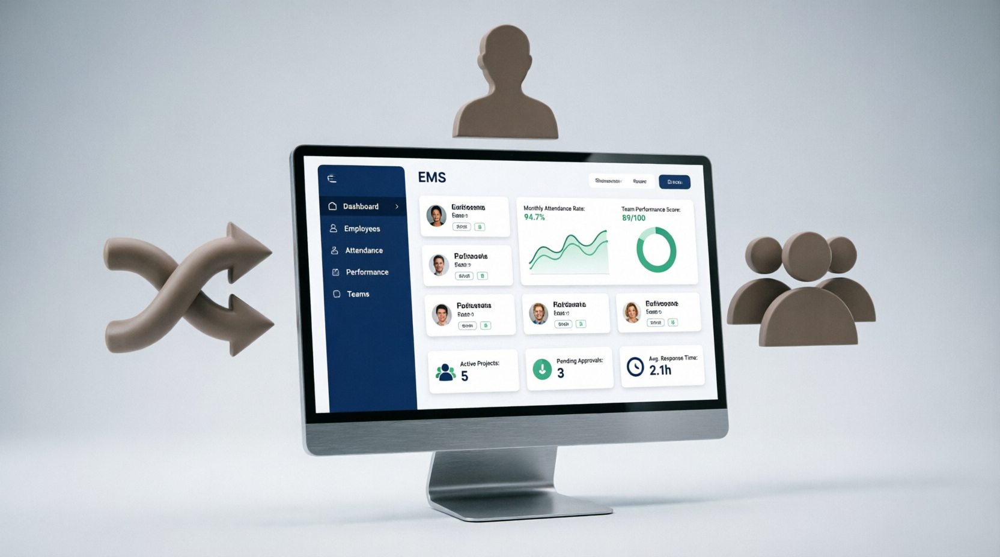

<h1 align="center">Hi 👋, I'm Zahur Shaikh</h1> 
<h3 align="center">Full Stack Developer | React Developer | MERN Stack Enthusiast</h3>

<p align="left">
  
</p>

<p align="left">
  <a href="https://github.com/ryo-ma/github-profile-trophy">
    
  </a>
</p>

<p align="center">
  Passionate about building scalable web applications, solving real-world problems, and continuously improving my software engineering skills.
</p>

<p align="center">
  <a href="mailto:zbshaikh1326@gmail.com">
    
  </a>
  <a href="https://jahurhusen-portfolio.vercel.app/">
    
  </a>
  <a href="https://www.linkedin.com/in/jahurhusen-shaikh-a309361b9/">
    
  </a>
</p>

---

# 🚀 About Me

- 💻 Full Stack Developer focused on MERN Stack development
- 🌱 Currently learning **Advanced Backend Development, DSA, System Design, and Next.js**
- 🔭 Building modern web applications using React, Node.js, Express, and MongoDB
- 👯 Open to collaborating on Full Stack and Open Source projects
- 📚 Consistently improving problem-solving and software engineering skills
- ⚡ Interested in scalable architectures, clean code, and performance optimization
- 🎯 2026 Goal: Secure a high-growth Software Engineer role and contribute to impactful products

---

# 🛠️ Tech Stack

### Frontend

<p>
  
</p>

### Backend

<p>
  
</p>

### Databases

<p>
  
</p>

### Programming Languages

<p>
  
</p>

### Tools & Platforms

<p>
  
</p>

### 📚 Currently Learning

<p>
  
</p>

```text
Frontend   : React.js, Next.js, Tailwind CSS, Redux
Backend    : Node.js, Express.js
Database   : MongoDB, MySQL, Firebase
Languages  : JavaScript, TypeScript, Java
Mobile     : React Native
Tools      : Git, GitHub, Docker, Postman, VS Code
Deployment : Vercel, Netlify
Learning   : DSA, System Design, Advanced Backend
```

---

# 📈 Current Focus

```text
✔ React Ecosystem
✔ MERN Stack Development
✔ REST APIs
✔ Authentication & Authorization
✔ Database Design
✔ DSA Preparation
✔ System Design Fundamentals
```

---

# 🌟 Featured Projects

## 🚀 AI Resume Analyzer SaaS

<p align="center">
  
</p>

### 🔗 Links

- 🌐 Live Demo: [Available-Soon]
- 📂 GitHub: [Available-Soon]

### 🛠 Tech Stack


### ✨ Features

- User Authentication
- Resume Upload & Analysis
- AI-Powered Feedback
- Dashboard Analytics
- Responsive Design

---

## 🚀 Code Analyzer - AI Powered

<p align="center">
  
</p>

### 🔗 Links

- [🌐 Live Demo Analyzer - AI Powered Analyzer - AI Powered](https://code-analyzer-five.vercel.app/)
- 📂 GitHub: <https://github.com/Zahur13/code-analyzer.git>

### 🛠 Tech Stack


### ✨ Features

- Code Upload & Analysis
- AI-Powered Code Reviews
- Bug Detection & Suggestions
- Code Quality Metrics
- User Authentication
- History of Analyses

---

## 🏢 Large Scale - Employee Management System

<p align="center">
  
</p>

### 🔗 Links

- [🌐 Live Demo Employee Management System](https://workflow-ems.vercel.app/)
- 📂 GitHub: <https://github.com/Zahur13/workflow-ems.git>

### 🛠 Tech Stack


### ✨ Features

- Employee CRUD Operations
- Role-Based Access Control
- Attendance Management
- Leave Management
- Admin Dashboard
- Reporting & Analytics

---

# 🏆 Achievements

- 🎓 Bachelor of Engineering Graduate
- 💼 Completed Front-End Development Internship
- 🌐 Built multiple Full Stack Projects
- 📚 Actively learning DSA and Backend Development
- 🚀 Consistently improving development workflow and coding practices

---

# 📊 GitHub Analytics

<p align="center">
  
</p>

<p align="center">
  
</p>

<p align="center">
  
</p>

---

# 📫 Connect With Me

- 📧 Email: <zbshaikh1326@gmail.com>
- 💼 LinkedIn: [Jahurhusen Shaikh](https://www.linkedin.com/in/jahurhusen-shaikh-a309361b9/)
- 🌐 Portfolio: [jahurhusen-portfolio.vercel.app](https://jahurhusen-portfolio.vercel.app/)

---

# 💡 Developer Philosophy

> "Great software is built by continuously learning, improving, and solving meaningful problems."

---

⭐ Thanks for visiting my profile. Feel free to explore my repositories and connect with me.
